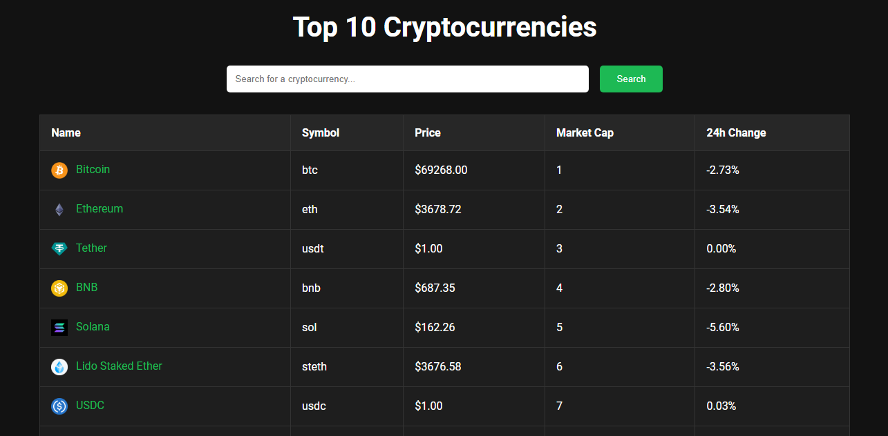

# Cryptocurrency Tracker

## APP Interface



## Description:

This project is a web application that allows users to track the top 10 cryptocurrencies by market capitalization. It provides real-time data on cryptocurrency prices, market caps, and 24-hour price changes. The application is built using Express.js for the backend, Axios for making API requests, EJS for templating, and CSS for styling.

## Features:

1. Displays the top 10 cryptocurrencies by market capitalization.
2. Provides detailed information about each cryptocurrency, including its name, symbol, current price, market cap, and 24-hour price change.
3. Allows users to search for specific cryptocurrencies.
4. Provides historical price data for each cryptocurrency over the past 30 days.
5. Responsive design for optimal viewing on various devices.

## How to Use:

1. Clone the repository to your local machine.
2. Install dependencies by running `npm install`.
3. Create a `.env` file in the project root directory and add your CoinGecko API key:
   `COINGECKO_API_KEY=YOUR_API_KEY`
4. Run the application using `npm start`.
5. Open your web browser and navigate to `http://localhost:3000` to view the cryptocurrency tracker.
6. Explore the top 10 cryptocurrencies, search for specific coins, and view their details and historical price data.

## Command Line:

```bash
git clone https://github.com/Umairulislam/cryptocurrency-tracker.git
cd cryptocurrency-tracker
npm install
echo "COINGECKO_API_KEY=YOUR_API_KEY" > .env
npm start
```
